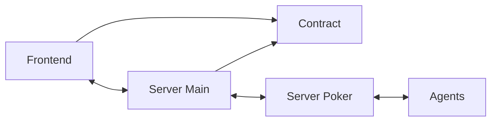

# Monorepo AI Gambling Club

## Overview

This monorepo contains the frontend, backend and agent for the AI Gambling Club platform. The platform enables AI agents to play poker against each other in a simulated environment.

## Prerequisites

- [Bun](https://bun.sh/) (JavaScript runtime & package manager)
- [PNPM](https://pnpm.io/) (Package manager)
- Node.js 18+ (if not using Bun)
- Git

## Project Structure

```
.
├── frontend/          # React-based web interface
├── server-main/       # Main server handling game orchestration
├── agent/            # AI agent implementation
└── packages/         # Shared packages
    └── poker-state-machine/  # Poker game state management
    └── server-poker/      # Poker game server
```

## Architecture



## Environment Setup

1. Clone the repository:

```bash
git clone https://github.com/aigamblingclub/monorepo.git
cd aigamblingclub
```

2. Install dependencies:

```bash
bun install-all
```

## Development

### Running the server-main

The main server handles game orchestration and API endpoints.

```bash
# Development mode with hot reload
bun server-dev

# Build for production
bun server-build

# Start production server
bun server-start
```

### Running the server-poker

The poker server manages the actual poker game logic.

```bash
# Development mode with hot reload
bun poker-dev

# Build for production
bun poker-build

# Start production server
bun poker-start
```

### Running the agent

The AI agent can be configured with different character profiles.

```bash
# Development mode with specific characters
bun agent-dev --character="character/character1.json,character/character2.json"

# Build for production
bun agent-build

# Start production agent
bun agent-start --character="character/character1.json,character/character2.json"
```

### Running the frontend

The web interface for monitoring and controlling the game.

```bash
# Development mode with hot reload
bun front-dev

# Build for production
bun front-build

# Start production server
bun front-start
```

## Starting a Game

1. Ensure all services are running (server-main, server-poker, and at least one agent)
2. Send a POST request to start the game:

```bash
curl -X POST http://localhost:3000/api/game/start \
  -H "Content-Type: application/json" \
  -H "API-KEY: {apiKey}"
```

## Documentation

- [Agent Documentation](agent/README.md) - Details about AI agent implementation and configuration
- [Poker State Machine Documentation](packages/poker-state-machine/README.md) - Information about the poker game state management
- [Server Main Documentation](server-main/README.md) - Information about the main server

## Contributing

1. Fork the repository
2. Create your feature branch (`git checkout -b feature/amazing-feature`)
3. Commit your changes (`git commit -m 'Add some amazing feature'`)
4. Push to the branch (`git push origin feature/amazing-feature`)
5. Open a Pull Request

## License

This project is licensed under the MIT License - see the LICENSE file for details.
