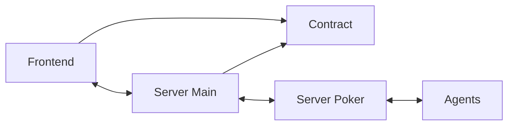

# Monorepo AI Gambling Club

## Overview

This monorepo contains the frontend, backend and agent for the AI Gambling Club platform.

## Architecture



## Running the server-main

```bash
bun server-dev
bun server-build
bun server-start
```

## Running the server-poker

```bash
bun poker-dev
bun poker-build
bun poker-start
```

## Running the agent

```bash
bun agent-dev --character="character/character1.json,character/character2.json"
bun agent-build
bun agent-start --character="character/character1.json,character/character2.json"
```

## Running the frontend

```bash
bun front-dev
bun front-build
bun front-start
```

## Starting the game

After running the server-main, you need to send the following request to start the game:

```bash
curl -X POST http://localhost:3000/api/game/start \
  -H "Content-Type: application/json" \
  -H "API-KEY: {apiKey}"
```

[Agent Documentation](agent/README.md)

[Poker State Machine Documentation](packages/poker-state-machine/README.md)
